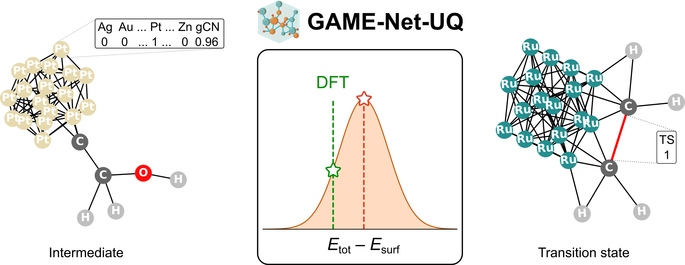

# GAME-Net-UQ

    

     
    

This repository contains the Python code used to train and evaluate GAME-Net-UQ, a graph neural network with uncertainty quantification (UQ) for predicting the DFT energy of relaxed species and transition states adsorbed on monometallic transition metal surfaces. 

## Conda environment

We will soon provide a .yml file from which generate the conda environment needed for the code. Main dependencies are: Python 3.11, Pytorch, Pytorch Geometric, ASE.

## DFT dataset

The DFT dataset `fg.db` (217 MB) used to train the GNN will be soon uploaded to Zenodo as ASE database including the DFT VASP relaxed geometries, simulation settings, and other metadata. 

## Graph dataset

The graph dataset (92 MB) can be automatically generated from the ASE database with the script `scripts/gen_dataset.py`. 

## Model training

To train the model, run the script `scripts/train_mve.py -i config.toml -o OUTDIR`. The `TEMPLATE.toml` file provides an explanation for each entry required in the training configuration file.

## Pretrained model

The final pretrained model is available within CARE ([link](https://github.com/LopezGroup-ICIQ/care)). 

## License

The code is released under the [MIT](./LICENSE) license.

## Reference

- **A Foundational Model for Reaction Networks on Metal Surfaces**  
  Authors: S. Morandi, O. Loveday, T. Renningholtz, S. Pablo-García, R. A. Vargas Hernáńdez, R. R. Seemakurthi, P. Sanz Berman, R. García-Muelas, A. Aspuru-Guzik, and N. López  
  DOI: [10.26434/chemrxiv-2024-bfv3d](https://doi.org/10.26434/chemrxiv-2024-bfv3d)
